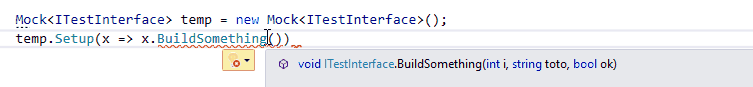
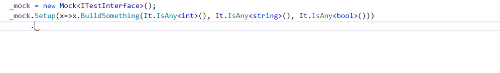
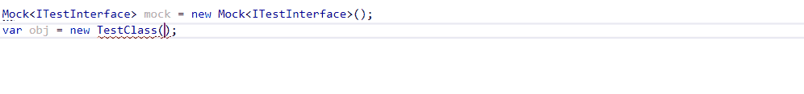
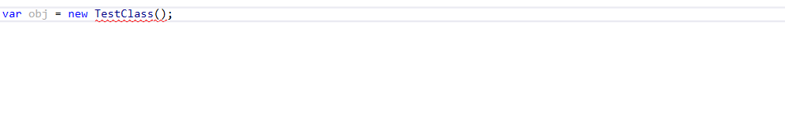

# Abc.MoqComplete
MoqComplete is a Resharper plugin which provide auto-completion for the Moq framework

## Features
### It.IsAny completion
Suggest It.IsAny() when setting up mocked method

### Callback Completion
Suggest full Callback<...> method

### Mock suggestion
Suggest existing mock.Object

Or new Mock in constructor

