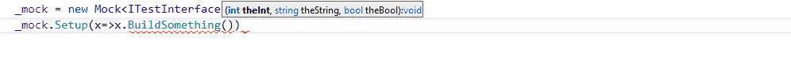

# Abc.MoqComplete
MoqComplete is a Resharper plugin which provide auto-completion for the Moq framework 
Works with Resharper 2018.3.1

## Features
### It.IsAny completion
Suggest `It.IsAny()` when setting up mocked method

Suggest `It.IsAny()` when using verify on mocked method

### Callback Completion
Suggest full `Callback<...>` method

### Suspicious Callback Detection
Detect suspicious `Callback`

### Returns Completion
Suggest full `Returns` method

### Mock suggestion
Suggest existing `mock.Object`

Or new `Mock` in constructor

## About
Inspired by AgentZorge, which is deprecated
