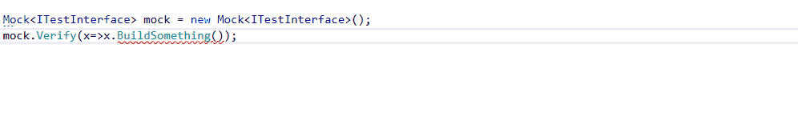

# Abc.MoqComplete
MoqComplete is a Resharper plugin which provide auto-completion for the Moq framework (and Moq.AutoMock) 
Works with latest Resharper 2020 and Rider (**non EAP**)

[

](https://www.jetbrains.com/?from=MoqComplete)

## Features
### It.IsAny completion
Suggest `It.IsAny()` when setting up mocked method

Suggest `It.IsAny()` when using verify on mocked method

### Callback Completion
Suggest full `Callback<...>` method

### Returns Completion
Suggest full `Returns<...>` method

### Suspicious Callback Detection
Detect suspicious `Callback`

### Mock suggestion
Suggest existing `mock.Object`

Or new `Mock` in constructor

### Fill with Mock
Fill an object with `Mock` objects (using fields or local variables)

### Mock variable name completion
Suggest the mock variable name

## Installation
The plugin can be installed using the extension manager from Resharper menu in Visual Studio, or using the plugin menu from Rider settings
